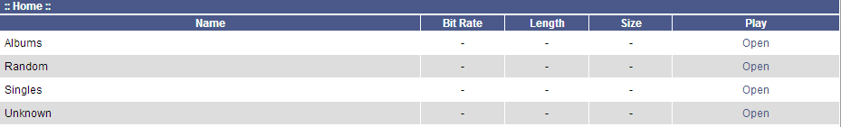
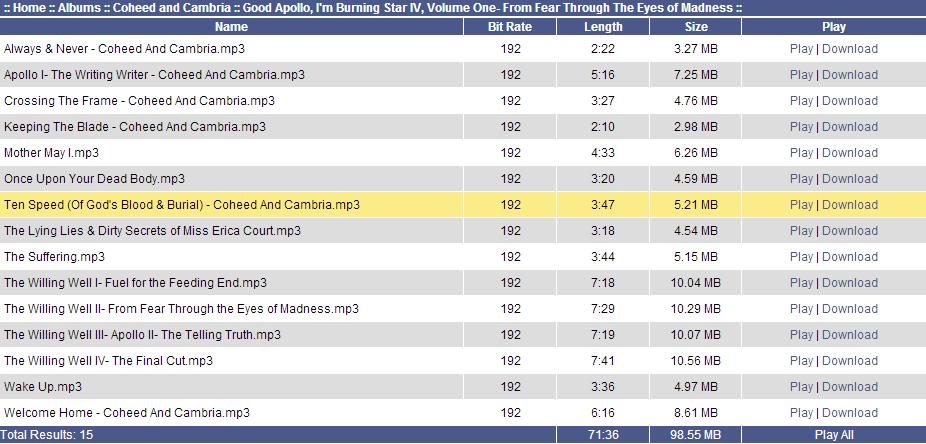

MP3 Player
==========

**Version 1.1.2**

Review the latest changes from the [CHANGELOG.md](CHANGELOG.md).

[](https://travis-ci.org/diemuzi/mp3)
[](https://packagist.org/packages/diemuzi/mp3)
[](https://packagist.org/packages/diemuzi/mp3)
[](https://www.versioneye.com/user/projects/52e2d329ec1375da4b00001a)

Introduction
------------

MP3 Player is a web-based music player which streams content to your local PC in several formats.

Supported formats are currently:

  * PLS (Winamp)
  * M3U (Windows Media Player)

Support
-------

* We can be found on the Freenode IRC Network in #otwebsoft
* More information is always available in the [Wiki](../../wiki)

Requirements
------------

* [Zend Framework 2](https://github.com/zendframework/zf2)

* [PHP Gettext Extension](http://php.net/gettext)

* [PHP Phar Extension](http://php.net/phar) *Recommended, but not required*

Features
--------

* Searchable
* Translatable
* Play Full Albums or Single Songs
* Download Folders in .zip, .tar, .bz2, and .rar Formats (Requires PHP Phar Extension)
* Download Songs from your library
* More coming soon, see [TODO.md](TODO.md)

Installation
------------

1. Install the module via composer by running:

   ```sh
   php composer.phar require diemuzi/mp3:dev-master
   ```
   or download it directly from github and place it in your application's `module/` directory.
2. Add the `Mp3` module to the module section of your `config/application.config.php`.
3. Edit `config/autoload/mp3.global.php` and change the settings per your configuration.

Screenshots
-----------

Main Screen



Play Lists


